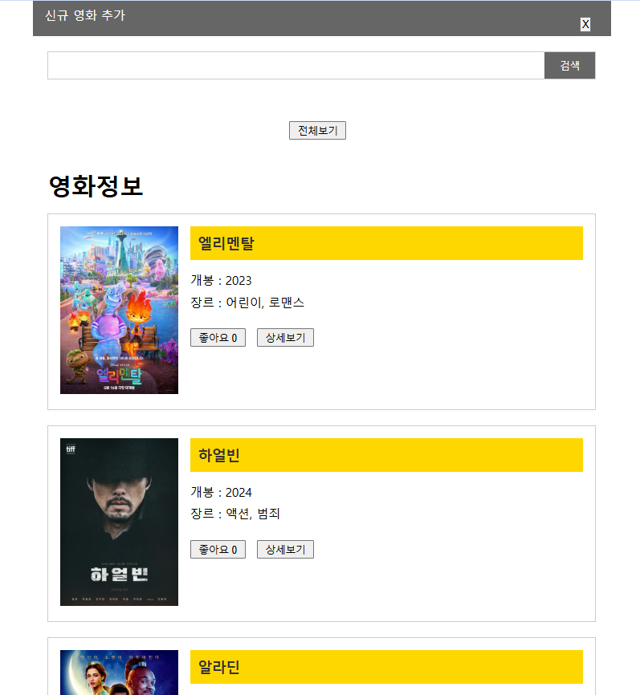
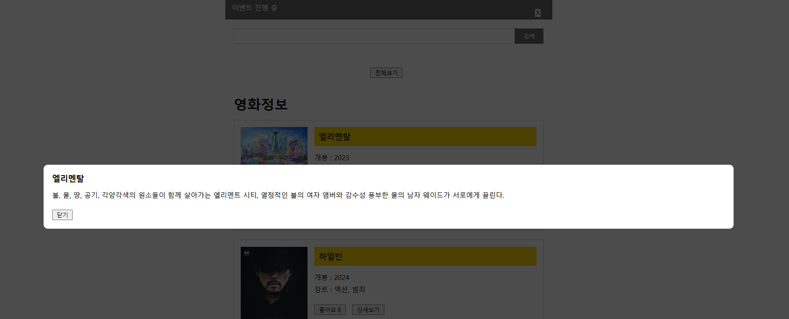
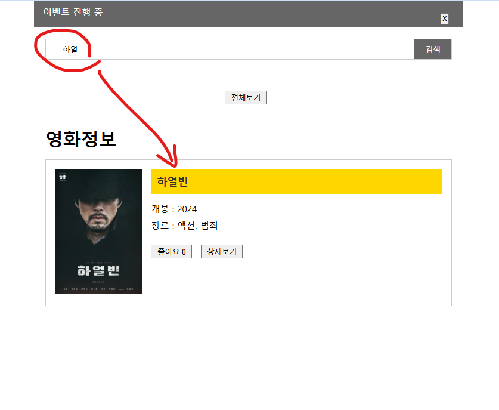
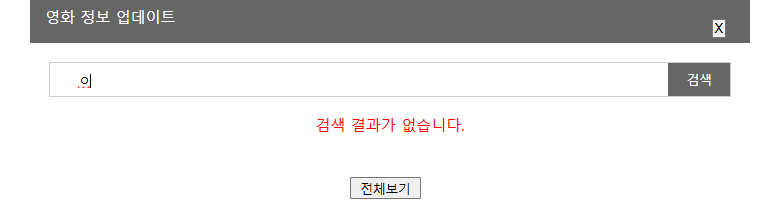
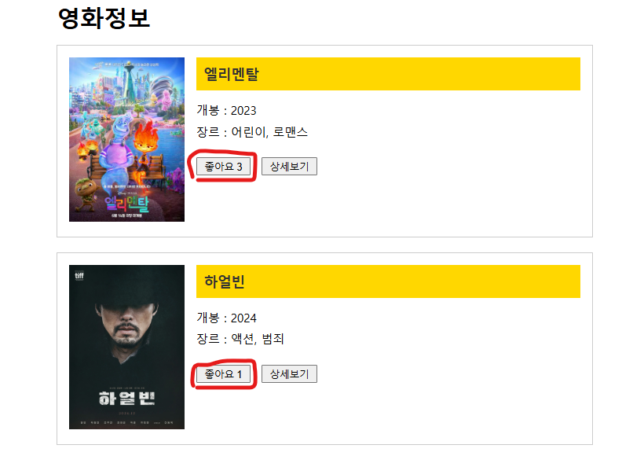

# Svelte Study

Svelte 기초 강좌 실습 따라하기

👉🏻 Youtube : [2024 Svelte 강좌 한방에 몰아보기](https://youtu.be/hWbwu5dM7k8?feature=shared)

## 프로젝트 환경
- Svelte : 5.15.0
- Vite : 6.0.5

## Study 내용
1. Svelte + Vite 프로젝트 생성
2. Svelte 기초 문법 _ 반복문 사용하기
3. onClick 등 Event 활용하기
4. Reactive 객체 활용하기
5. 동적 이미지 추가 및 style 변경 
6. Svelte 기초 문법 _ 조건문 사용하기
7. 조건문 사용한 동적 콘텐츠 추가 (Modal 등)
8. Data 가져와서 출력하기, 동적 바인딩 추가
9. 부모-자식 간 데이터 전달 및 변경하기
10. 모듈-컴포넌트화 진행하기
11. 동적 Class를 추가하여 이벤트 창 표시하기
12. Svelte 응용 _ 내장 Transition 사용하기
13. Svelte 기초 문법 _ $: 문법 사용하기
14. 검색 기능 로직 구현 
15. Life Cycle 학습 (OnMount, AfterUpdate, OnDestroy)
16. setInterval 활용

## Study 결과물
1. Main Page

2. 상세보기 버튼 클릭 시 Modal 오픈

3. 검색 기능 실행 시
- 검색 결과가 있을 경우

- 검색 결과가 없을 경우

4. 좋아요 기능
- 각 영화의 ID로 좋아요 개수 개별 연동

5. 이벤트 문구 출력 기능
- 페이지 최상단
    - 이벤트 문구 출력 : setInterval을 통한 자동 문구 변경
    - 이벤트 영역 애니메이션 적용 : svelte 내장 transition (fly, fade 활용)
